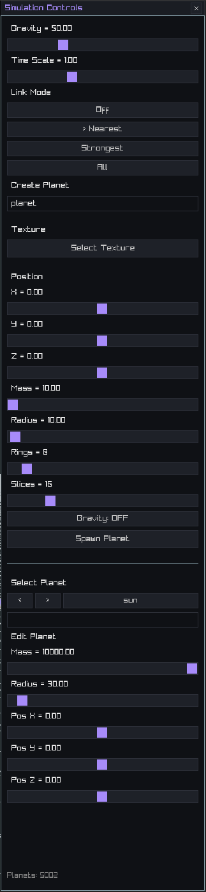
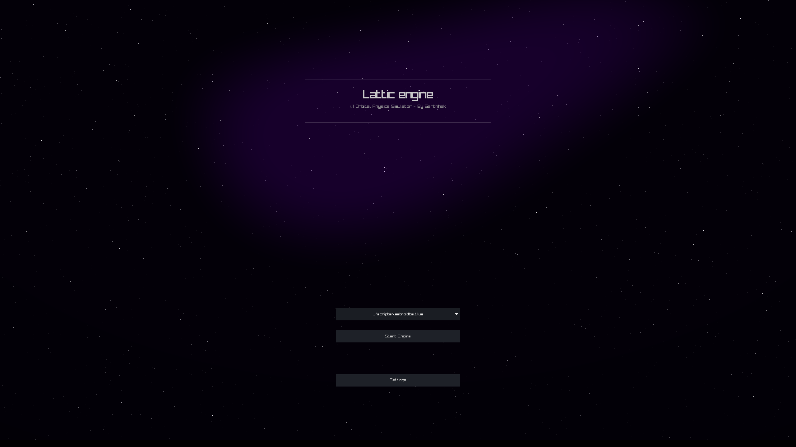

# Lattic Engine

Lettic engine is a real time **3D orbital mechanics simulator** written in **C** using **raylib**.  
This project simulates gravitational interaction between celestial bodies using Newtonian physics and numerical integration.

The goal of this project was **not ultra realism or NASA level accuracy**, but to:
- understand vector math
- apply classical mechanics (`F = ma`)
- build a stable physics update loop
- understand optimization techniques with run-time rendering 
- explore multi-threading
- visualize orbital motion in 3D
- **and most Importantly** have a fun engine to play around with!

---

## Demo


---

## Screenshots

### Simulation UI


### Main Menu


---

## Features

- Real time **N-body gravity simulation**
- Stable orbits using **Verlet integration**
- **Custom planets** with **custom textures** that can be added by the user
- **Lua scripting** layer for advanced modifications
- **Save/load system** for different simulations
- Runtime UI controls using **raygui**
- Freefly 3D camera
- Multiple gravity sources supported
- Native windows support and linux support (via wine)
- Better UI/UX implementation with more properties
- Multi-threaded asset loading for faster loading times
- Cross-platform builds and cross completion
- Grid and debug rendering tools

---

## Features I plan on adding

- Orbit trails
- Skybox

---

## Features that are out of scope

- Einstein orbital physics / General relativity
- Ray or path tracing

---

## How does it work?

The simulation is based on **Newtonian gravity** model:

**F = G * m1 * m2 / r²**

From this:

Each frame:
1. Compute gravitational force from all gravity sources
2. Convert force → acceleration
3. Integrate velocity
4. Integrate position

This produces **elliptical orbits** when the initial velocity is set correctly.

---

## Integration Method

The simulator uses a **velocity aware Verlet / semi-implicit integrator**:

**x(t+dt) = x(t) + v(t)·dt + ½a(t)·dt²**  
**v(t+dt) = v(t) + ½(a(t) + a(t+dt))·dt**

In simpler terms, velocity is updated using the **average acceleration over the timestep**, rather than assuming constant acceleration as in Euler integration due to there being a limited timestep (in other words fps or calulations per second) and IEEE-754 causing small numarical errors **but this is not the primary cause** of instablity unstable orbits.  
This is more stable than **naive Euler integration** and helps **reduce energy drift**.

---

## Scripts & Simulations

This engine supports loading simulations via Lua scripts.

On startup, the engine scans the scripts folder and allows selection a simluation through the user interface. Each script defines a world, planets and initial conditions.

Several example simulations are included to demonstare performance, stablity and orbital behavior. Feel free to try them out and have fun!

Note: lower values in the scripts if you notice bad perfromance (more optimaiztions are on the way but hardware limitaions can also cause this the values have been tuned for my high end pc with a 7800xt, 32gb ddr5 and ryzen 5 7600x)

---

## Optimizations

- Lazy-loaded textures lowering VRAM usage, RAM usage and massively program load times

---

## Controls/Keybinds

| Key | Action |
|----|-------|
| WASD | Move camera |
| Mouse | Look around |
| SPACE / SHIFT | Vertical movement |
| ENTER | Enable cursor |
| RSHIFT | Disable cursor |
| M | Toggle Menu |
| P | Toggle Time |
| ESC | Back to menu |

---

## Building the project

## WINDOWS
# Requirements **IMPORTANT** 
- MSYS2 (MinGW64 environment)
- MinGW-w64 GCC compiler
- Cmake

# Build Instructions 

```
git clone https://github.com/sarthhakarora/Orbital-Physics-Simulator.git
mkdir build
cmake -S . -B build -G "MinGW Makefiles"
cd build
cmake --build . --target run
```

## LINUX
# Requirements **IMPORTANT** 
```
- MinGW-w64 GCC compiler
- Cmake
- Wine
```

# Build Instructions (wine)

**WARNING: ** This is not native linux support this is running on linux via the translation layer wine
```
git clone https://github.com/sarthhakarora/Orbital-Physics-Simulator.git
mkdir build
cmake -S . -B build -DCMAKE_SYSTEM_NAME=Windows -DCMAKE_C_COMPILER=x86_64-w64-mingw32-gcc
cd build
make
```

---

## Optional runtime flags:

orbitalPhysics.exe --showlogs

---

## Development (VS Code)

```
This repo includes optional VS Code configs for:
- CMake
- GCC
- GDB debugging (F5)

They are not required to build the project.
```

---

## Tech Used

- I have tried to stay minimal with libraries used and have only kept essential ones.

- **Language:** C (C11)
- **Compiler:** GCC (No msvc port yet)
- **Graphics:** raylib
- **Math:** raymath
- **UI:** raygui
- **Miscellaneous:** Win32 API, Lua API
- **Platform:** Windows, Linux (wine)
